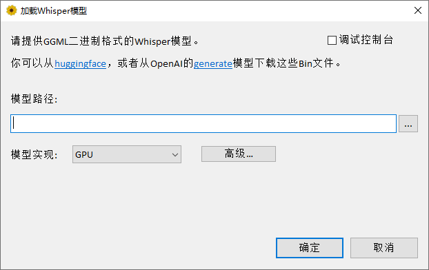
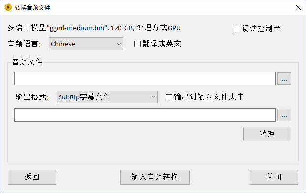
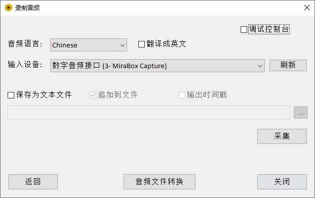


该项目是[Const-me/Whisper](https://github.com/Const-me/Whisper)的汉化版本，只翻译了WhisperDesktop中的界面部分，没有对功能进行修改。

> 以下内容翻译自源项目[Const-me/Whisper](https://github.com/Const-me/Whisper)，并不代表此项目描述。

----

该项目是[whisper.cpp](https://github.com/ggerganov/whisper.cpp)实现的Windows移植。
它又是[OpenAI's Whisper](https://github.com/openai/whisper)自动语音识别 (ASR) 模型的C++端口。

# 快速入门指南

从该存储库的`Releases`部分下载 `WhisperDesktop.zip`，解压 ZIP，然后运行 ​​`WhisperDesktop.exe`。

在第一个屏幕上，它会要求您下载模型。

我推荐 `ggml-medium.bin` （大小为 1.42GB），因为我主要使用该模型测试了该软件。

下一个屏幕允许转录音频文件。

还有另一个屏幕可以捕获和转录或翻译来自麦克风的实时音频。

# 特征

- 基于 DirectCompute 的与供应商无关的 GPGPU；该技术的另一个名称是“Direct3D 11 中的计算着色器”
- 纯 C++ 实现，除了必要的操作系统组件之外没有运行时依赖项
- 比 OpenAI 的实施快得多。
- 在我配备 GeForce [1080Ti](https://en.wikipedia.org/wiki/GeForce_10_series#GeForce_10_(10xx)_series_for_desktops) GPU 的台式计算机上，中等型号，使用 PyTorch 和 CUDA 转录 [3:24音频](https://upload.wikimedia.org/wikipedia/commons/1/1f/George_W_Bush_Columbia_FINAL.ogg)需要 45 秒，但使用我的实现和 DirectCompute 只需要 19 秒。
- Funfact：这是 9.63 GB 的运行时依赖项，而 `Whisper.dll` 为 431 KB
- 混合 F16/F32 精度: 自 D3D 版本 10.0 起，Windows 需要支持`R16_FLOAT`缓冲区
- 内置性能分析器，可测量各个计算着色器的执行时间
- 内存使用率低
- 用于音频处理的 Media Foundation，支持大多数音频和视频格式（Ogg Vorbis 除外）以及大多数在 Windows 上工作的音频捕获设备（除了一些仅实现 [ASIO](https://en.wikipedia.org/wiki/Audio_Stream_Input/Output) API 的专业设备）。
- 用于音频捕获的语音活动检测。
- 该实现基于 Mohammad Moattar 和 Mahdi Homayoonpoor 于 2009 年发表的文章[一种简单但高效的实时语音活动检测算法](https://www.researchgate.net/publication/255667085_A_simple_but_efficient_real-time_voice_activity_detection_algorithm)。
- 易于使用的 COM 风格 API。 [nuget](https://www.nuget.org/packages/WhisperNet/) 上提供了惯用的 C# 包装器。
- 版本 1.10 [引入](https://github.com/Const-me/Whisper/tree/master/WhisperPS)了对 PowerShell 5.1 的脚本支持，这是 Windows 上预安装的较旧的“Windows PowerShell”版本。
- 可用预构建的二进制文件

唯一受支持的平台是 64 位 Windows。

应该适用于 Windows 8.1 或更高版本，但我只在 Windows 10 上进行了测试。

该库需要支持 Direct3D 11.0 的 GPU，到 2023 年，这意味着“任何硬件 GPU”。不支持 D3D 11.0 的最新 GPU 是 2011 年的 Intel [Sandy Bridge](https://en.wikipedia.org/wiki/Sandy_Bridge)。

在CPU方面，该库需要[AVX1](https://en.wikipedia.org/wiki/Advanced_Vector_Extensions)和[F16C](https://en.wikipedia.org/wiki/F16C)支持。

# 开发者指南

## 构建说明

1. 克隆这个存储库
2. 在 Visual Studio 2022 中打开` WhisperCpp.sln` 。我使用的是免费软件社区版，版本 17.4.4。
3. 切换到 `Release` 配置
4. 在解决方案的 `Tools` 子文件夹中生成并运行 `CompressShaders` C# 项目。要运行该项目，请在 Visual Studio 中右键单击“设置为启动项目”，然后在 VS 主菜单中“调试/启动而不调试”。成功完成后，您应该看到一个控制台窗口，其中包含如下行：
`Compressed 46 compute shaders, 125 kb -> 20.0 kb`
5. 构建 `Whisper` 项目以获取本机 DLL，或构建 `WhisperNet` 以获得 C# 包装器和 `nuget` 包或示例。

## 其他注意事项

如果要在使用 Visual C++ 2022 或更高版本构建的软件中使用该库，您可能会以 `.msm` 合并模块或 [vc_redist.x64.exe](https://learn.microsoft.com/en-us/cpp/windows/latest-supported-vc-redist?view=msvc-170) 二进制文件的形式重新分发 Visual C++ 运行时 DLL。

如果这样做，请右键单击 `Whisper` 项目，属性，C/C++，代码生成，将“运行时库”设置从 `Multi-threaded (/MT)` 切换到 `Multi-threaded DLL (/MD)`, 并重建：二进制文件将变得更小。

该库包含 [RenderDoc](https://renderdoc.org/) GPU 调试器集成。

从 RenderDoc 启动程序时，按住 F12 键以捕获计算调用。

如果您要调试 HLSL 着色器，请使用 DLL 的调试版本，它包括着色器的调试版本，您将在调试器中获得更好的用户体验。

该存储库包含大量仅用于开发的代码：耦合替代模型实现、某些计算着色器的兼容 FP64 版本、调试跟踪和比较跟踪的工具等。

这些东西被预处理器宏或 `constexpr` 标志禁用，我希望保留在这里没问题。

## 缺失的功能

未实现自动语言检测。

在当前版本中，实时音频捕获的延迟很高。

具体来说，根据语音检测，该数字约为 5-10 秒。

至少在我的测试中，当我提供太短的音频片段时，模型不满意。

我增加了延迟并结束了，但理想情况下，这需要更好的修复以获得最佳用户体验。

# 最后的话

从我的角度来看，这是一个无偿的爱好项目，我在 2022-2023 冬季节日期间完成。

该代码可能有错误。

该软件“按原样”提供，不提供任何形式的保证。

感谢 [Georgi Gerganov](https://github.com/ggerganov) 实现了 [whisper.cpp](https://github.com/ggerganov/whisper.cpp) 以及 GGML 二进制格式的模型。

我不会编写 Python 程序，对 ML 生态系统一无所知。

如果没有良好的 C++ 参考实现来测试我的版本，我什至不会启动这个项目。

whisper.cpp 项目有一个示例，它使用相同的 GGML 实现来运行另一个 OpenAI 模型 [GPT-2](https://github.com/ggerganov/whisper.cpp/blob/master/examples/talk/gpt-2.cpp)。

使用本项目中已实现的计算着色器和相关基础设施来支持 ML 模型应该不难。

## 赞助译者

如果您觉得本项目对你有帮助，欢迎给予我们一定的捐助来翻译项目的长期发展。

### 支付宝扫码捐赠

### 微信扫描捐赠

